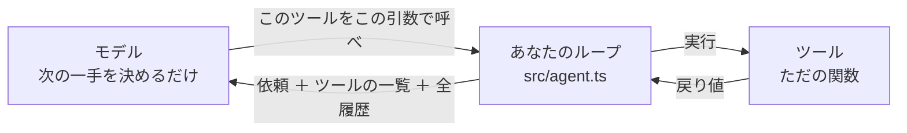

# これだけ ── AIエージェントの要点

> 事前に配るのはこの1枚だけです。**5分**で読めます。
> キックオフのスライドもここから作ります（`---` が1枚の区切り）。当日は Slack にピン留めして、詰まったら戻ってきてください。

---

## 1. エージェントの本体は30行のループ

新しい技術はほとんど出てきません。やっているのはこれだけです。

```
① モデルに送る    …… 依頼 ＋ ツールの一覧 ＋ これまでの全履歴
② モデルが返す    …… 「このツールを、この引数で呼べ」
③ あなたが実行する …… ただの関数を呼ぶだけ
④ 結果を履歴に足して ① に戻る
   モデルが「もう終わり」と言ったら抜ける
```

このループは**すでに書いてあります**（`src/agent.ts`）。読むのは自由ですが、書く必要はありません。

---

## 2. モデルは関数を実行しない



**モデルとツールの間に線がありません。** モデルは「呼べ」と言うだけで、実際に呼ぶのはあなたのコードです。

だから「AIが勝手に何かする」ことは原理的に起きません。危ないツールを渡さなければ何も起きないし、実行前に人間の確認を挟むこともできます。

---

## 3. モデルは毎回、記憶を失う

だからループは、毎回これまでの全部を送り直しています。

```
1周目   [依頼]
2周目   [依頼][指示①][報告①]
3周目   [依頼][指示①][報告①][指示②][報告②（ファイル全文）]
        └───── 3周目は、この全部を毎回送っている ─────┘
```

会話が伸びているのではなく、**まるごと再送しています。**

ツールの戻り値にファイル全文を詰めると、それ以降の全周回でその全文を送り続けることになります。**戻り値は必要な分だけ返す。** これがコストにも精度にも効きます。

---

## 4. description は、コメントではなくプロンプトの一部

いちばんよくある詰まり方は「モデルがツールを呼んでくれない」で、原因はほぼ毎回これです。

モデルはツールの**説明文しか読んでいません。** 実装は見えていません。

| ✕ | `"ファイルを読む"` |
| --- | --- |
| ○ | `"社内資料の中身を返す。パスが分からないときは、先に list_files か search_files を使うこと"` |

**「何をするか」だけでなく「いつ使うか」まで書く。** 呼ばれないときは、まず説明文を疑ってください。

---

## 5. 合宿で書くのは1ファイルだけ

`src/tools.ts` に3つ書きます。エージェントの中身はこの3つで全部です。

| | 何を書くか |
| --- | --- |
| `SYSTEM_PROMPT` | 役割と、守ってほしい方針 |
| `tools` | ツールの名簿。モデルが読むのはここだけ |
| `runTool` | ツールの中身。**ただの関数。AIの知識は要らない** |

ループ・コスト計測・承認ゲート・安全装置は用意してあります。触らなくても全部効きます。

書き方に詰まったら、動く作例が3つあります。**丸ごとコピーして始めてOK**です。

```bash
cp examples/doc-agent/tools.ts   src/tools.ts   # ローカルのファイルを読む
cp examples/http-agent/tools.ts  src/tools.ts   # HTTP を叩く
cp examples/state-agent/tools.ts src/tools.ts   # 状態を書き換える
```

---

## 6. 作業量の8割は、普通のプログラミング

| 工程 | 目安 | 中身 |
| --- | --- | --- |
| 何を自動化するか決める | 30分 | 「誰の、どの手作業か」まで具体化する |
| どんなツールが要るか決める | 1時間 | 3〜5個に絞る。**設計の本体はここ** |
| **ツールの中身を実装** | **半日〜1日** | ただの関数。API叩く、DB引く、ファイル読む |
| システムプロンプトを書く | 1時間 | 役割と方針 |
| **回して直す** | **1日** | 説明文とプロンプトを詰める |

新しいスキルなのは最後の「回して直す」だけです。それも「モデルは説明文しか読んでいない」の一点を覚えておけば、だいたい自力で詰められます。

---

## 7. 詰まったら、この順に

| 症状 | まず疑うところ |
| --- | --- |
| ツールを呼んでくれない | `description`。「いつ使うか」が書いてあるか |
| 同じツールを何周も呼び続ける | 戻り値。空か、エラーか、次に何をすべきか書いてないか |
| 変な引数を渡してくる | `input_schema` の `description`。例を書く |
| 遅い・高い | ツールが多すぎないか。戻り値が長すぎないか |
| 何も分からない | `-v` を付けて実行する。考えていることが見える |

**それでも詰まったら、ツールを減らしてください。** 5個で動かないものは、2個なら動きます。

---

## 最初の一歩

```bash
bun install
cp env.example .env    # 運営から配られたキーを貼る
bun run check          # 疎通確認
bun run agent "今日は何日?" -v
```

**「あ、これだけか」となったら準備完了**です。

---

*もっと詳しく: [電話越しの現場監督](02-agent-primer.md)（10分） ／ 当日の手順: [ハンズオン](04-handson.md) ／ 全ステップ: [作る順番](05-reference.md)*
