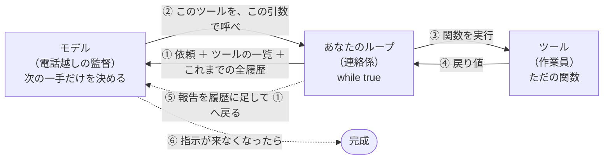
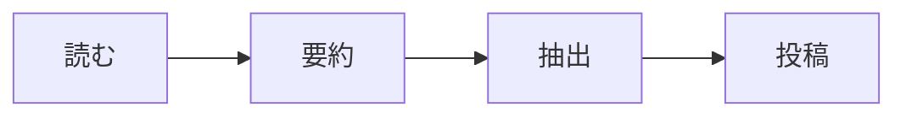
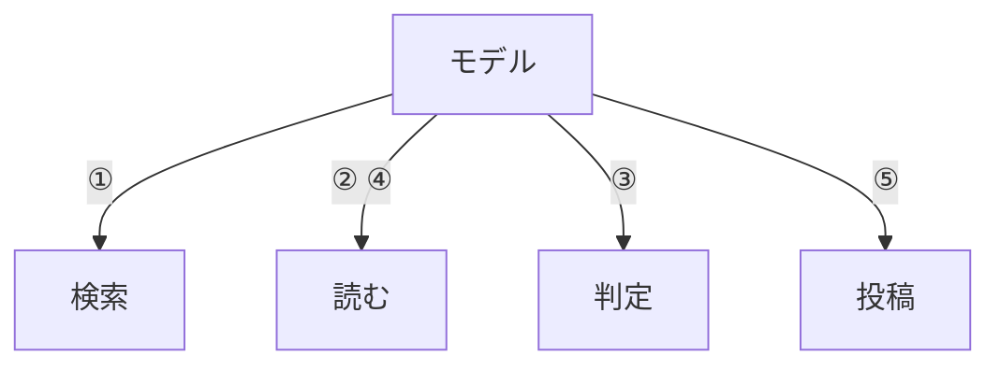

# 電話越しの現場監督 ── AIエージェントとは何か

> [これだけ](00-tldr.md) の詳しい版です。（10分）
> 先にあちらを読んでください。1枚で足ります。**ここは、腑に落ちなかったときに戻ってくる場所**です。

結論から書くと、AIエージェントの本体は **30行のループ** です。特別な技術はほとんど出てきません。

---

## 1. 電話越しの、記憶をなくす現場監督

**モデルが現場監督で、ツール（関数）が作業員。** 監督は自分では作業せず、状況に応じて「次はこれをやれ」と割り振る。

ただしこの監督には、変わったところが3つあります。**その変なところが、そのまま設計上の勘所になります。**

### 監督は現場にいない。電話越しに指示している

監督は別の街の事務所にいて、現場を一度も見たことがありません。無線で「Aさん、あの壁の寸法を測って報告して」と言うだけ。返ってきた**報告書のテキストしか**、現場の情報がありません。

だから**報告書の書き方（＝ツールの戻り値の設計）が全て**です。

### 監督と作業員は、直接つながっていない

ここが比喩からいちばん抜けやすいところです。監督が「Aさんに測らせろ」と言っても、Aさんは動きません。監督の指示を受け取って、実際にAさんのところへ行かせて、結果を持ち帰る**連絡係**が必要です。

この連絡係が**ループ**です。合宿ではテンプレートに入れてありますが、書いても30行です。Claude Code でいうと、Claude Code 本体がこれをやっています。

### 監督は毎回、記憶を失う

監督は前回何を指示したか覚えていません。だから連絡係は、指示を出すたびに**これまでの全やりとりの束**を最初から読ませ直しています。

変な設定に見えますが、これが事実です。そしてこの事実が、後で出てくるコストの話に直結します。

> **まとめると**
> 現場を見たことがなく、作業員に直接触れず、毎回これまでの報告書の束を読み直してから、次の一手だけを指示してくる監督。
> 奇妙に見えますが、この3つはどれも技術的な事実です。そしてどれも、あとで設計判断として効いてきます。

---

## 2. 全体像



**要点は「モデルとツールの間に線がないこと」です。** すべてのやりとりが中央のループを経由します。モデルは「これを呼べ」と言うだけで、実際に呼ぶのはあなたのコードです。

だから承認ゲートもログもコスト計測も、全部この中央に差し込めます。

> **つまり**
> 「AIが勝手にファイルを書き換える」ということは、原理的に起きません。書き換えるのは常にあなたのコードです。危ないツールを渡さなければ何も起きないし、実行前に確認を挟むこともできます。
> Claude Code が破壊的なコマンドの前に確認を出すのは、まさにこの中央の位置に人間を挟んでいるからです。

---

## 3. 比喩と用語の対応

| 比喩 | 技術的には | あなたが書くもの |
| --- | --- | --- |
| 現場監督 | モデル（`claude-opus-5` など） | 書かない。APIを呼ぶだけ |
| 作業員 | ツール ＝ ただの関数 | **書く。作業量の大半がここ** |
| 作業員の名簿 | `tools` のスキーマ定義 | 書く。説明文が超重要 |
| 連絡係 | エージェントループ | **用意済み**（`src/agent.ts`）。読むだけでよい |
| 「Aさんに測らせろ」 | `tool_use` ブロック | モデルが返してくる |
| 報告書 | `tool_result` ブロック | 関数の戻り値を詰める |
| これまでの報告書の束 | `messages` 配列 | ループが積み上げる |
| 朝礼の申し送り | システムプロンプト | 書く。役割と方針 |
| 「もう終わりです」 | `stop_reason != "tool_use"` | モデルが判断する |

> ⚠️ **初心者が必ずハマるところ**
> 「モデルがツールを呼んでくれない」。原因はほぼ毎回、**ツールの説明文が雑**です。監督は名簿の説明文しか読んでいません。
> 「ファイルを読む」ではなく「リポジトリ内のファイルの中身を返す。パスが分からないときは先に search を使うこと」まで書く。**ツールの説明文はコメントではなくプロンプトの一部**だと考えてください。

---

## 4. ワークフローとの違いは「誰が順番を決めるか」

LLMを使っていれば全部エージェント、というわけではありません。境目はひとつだけです。

### ワークフロー ── 順番は「あなた」が先に決めて固定



毎回まったく同じ道を通ります。LLMは部品として3回呼ばれるだけ。想定外が来ると詰まります。

### エージェント ── 順番は「モデル」がその場で決める



**番号は実行してみるまで決まりません。**「読む」を2回使ったのは、③の判定で情報が足りないとモデルが気づいたからです。同じ依頼でも入力が違えば通る道が変わります。

この軌道修正ができるかどうかが、ワークフローとエージェントの分かれ目です。

どちらが偉いという話ではありません。手順が完全に決まっている業務なら、ワークフローのほうが速くて安くて確実です。**エージェントが効くのは、手順を事前に書き切れない仕事のときだけ**です。

---

## 5. 監督は毎回、報告書を最初から読み直している

3つめの「毎回、記憶を失う」の話です。ここはコストに直結します。

```
1周目   [依頼]
2周目   [依頼][指示①][報告①]
3周目   [依頼][指示①][報告①][指示②][報告②（ファイル全文）]
        └──────── 3周目は、この全部を毎回送り直している ────────┘
```

**会話が伸びているのではなく、毎回まるごと再送しています。** ツールの戻り値にファイル全文を詰めると、以降のすべての周回でその全文を送り続けることになります。

「戻り値は必要な分だけ返す」がコストにも精度にも効くのは、このためです。

| 対策 | やること |
| --- | --- |
| プロンプトキャッシュ | 変わらない部分を先頭に固める（キャッシュ読み出しは通常入力の約1割） |
| 最大ターン数の上限 | テンプレートに設定済み（`MAX_TURNS = 20`） |
| 戻り値を絞る | テンプレートに設定済み（`MAX_TOOL_OUTPUT_CHARS`） |

---

## 6. コードで見ると30行

ここまでの図をそのままコードにしたものです。テンプレートの `src/agent.ts` に、ほぼこのまま入っています。

```ts
// ① 名簿：モデルに「こういうツールが使える」と教える。実装ではなく説明だけ
const tools = [{
  name: "read_file",
  description: "資料の中身を返す。パスが不明なら先に search_files を使うこと",
  input_schema: {
    type: "object",
    properties: { path: { type: "string" } },
    required: ["path"],
  },
}];

const messages = [{ role: "user", content: "経費精算の締め切りは?" }];

// ② 連絡係のループ
while (true) {
  const res = await client.messages.create({
    model: "claude-opus-5",
    max_tokens: 16000,
    tools,
    messages,                 // ← 毎回まるごと送っている
  });
  messages.push({ role: "assistant", content: res.content });

  // ③ 監督が「もう終わり」と言ったら抜ける
  if (res.stop_reason !== "tool_use") break;

  // ④ 指示された関数を、こっちで実行して報告書にする
  const results = [];
  for (const block of res.content) {
    if (block.type !== "tool_use") continue;
    const output = await runTool(block.name, block.input);  // ← ただの関数
    results.push({ type: "tool_result", tool_use_id: block.id, content: output });
  }
  messages.push({ role: "user", content: results });
}
```

これが全部です。`runTool` の中身は `readFile(path)` を返すだけ。

**あなたが普段使っている Claude Code も、構造としてはこれと同じループ**が回っています。違うのは、ツールが最初から充実していることと、承認ゲートやコンテキスト管理といった実運用の工夫が乗っていることだけです。

---

## 7. 合宿でやることの実像

| 工程 | 時間の目安 | 中身 |
| --- | --- | --- |
| 何を自動化するか決める | 30分 | 「誰の、どの手作業か」まで具体化する |
| どんなツールが要るか決める | 1時間 | 3〜5個に絞る。設計の本体 |
| **ツールの中身を実装** | **半日〜1日** | ただの関数。API叩く、DB引く、ファイル読む |
| システムプロンプトを書く | 1時間 | 役割と、守ってほしい方針 |
| **回して直す** | **1日** | 説明文とプロンプトを詰める |

**8割は普通のプログラミングです。** AI特有なのは下2つで、コード量としては薄い。

新しいスキルなのは最後の「回して直す」だけで、それも**「監督は説明文しか読んでいない」**という一点を覚えておけば、だいたい自力で詰められます。

---

## 最初の一歩

テンプレートを clone して、これを叩いてください。

```bash
bun install
cp env.example .env    # キーを貼る
bun run check
bun run agent "今日は何日?" -v
```

`-v` を付けると、監督が何を考えて次のツールを選んだかが見えます。
**「あ、これだけか」となったら準備完了**です。ツールを増やすのは、リストに要素を足すのと同じ作業です。

動くものを先に見たいなら、作例を丸ごとコピーしてください。

```bash
cp examples/doc-agent/tools.ts src/tools.ts
bun run agent "経費精算の締め切りはいつ?" -v
```

---

*1枚版: [これだけ](00-tldr.md) ／ 当日の手順: [ハンズオン](04-handson.md) ／ 作例3本: [examples/](../examples/README.md)*
