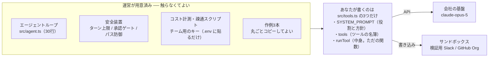

# 合宿キックオフ台本

> Day 1 の 13:00 から，参加者の前で話すための資料．節の番号は話す順です．
> 灰色の「説明者メモ」は投影せず，話す側だけが読む欄です．

| | |
| --- | --- |
| 話す時間 | 合計 45 分（13:00 から 3 ブロックに分けて話す） |
| 投影する | 01〜08 |
| 手元だけ | 説明者メモ・09 |
| 配布物 | テンプレート URL / キー |

> ⚠️ この台本は「事前課題をやってきた人」を前提に組んであります．
> Day 1 の持ち時間は 13:00–17:00 の 240 分しかなく，うち開発は 150 分です．当日にレベル合わせをする余裕はありません．
>
> そのため事前課題を 2 つ課します．D-7 に配って，D-1 までに完了報告をもらってください．
>
> 1. [これだけ](00-tldr.md) を読む（5 分）
> 2. [事前課題](03-handson.md) を各自でやる（45 分）．`bun run check` を通すところまで
>
> D-1 の時点で完了していない人を運営が把握しておくことが，この台本が成立する条件です． 当日 13:15 の 15 分で拾えるのは「環境が壊れている人」までで，「何も読んでいない人」は拾えません．

> 投影スライドを作る場合は，[これだけ](00-tldr.md) がそのまま下敷きになります（`---` が 1 枚の区切り）．

---

## 01. なぜこれをやるのか　`3分`

> こう切り出す
> 「この 2 日間で作るのは，AI エージェントです．目的は，動くものを 1 つ作って持ち帰ること．調べて詳しくなることではなく，作って詰まることが目的です．」

伝えるのは 3 点だけです．

- 使う側から作る側になる — 全員 Claude Code は使っている．あの裏側で何が起きているかを，自分の手で書いてみる
- 2 日で動くものを 1 つ — 大きさより，動くかどうか
- 詰まった話が一番の成果 — うまくいかなかった箇所は最終発表で共有する．それも加点対象

> 📝 説明者メモ
> ここで技術の話を始めないこと．「読んできましたか?」という挙手も取らないこと．読んでいない人を炙り出しても得るものはなく，その人が最初に萎縮します．
> 「エージェントとは何か」は事前課題で各自やってきている前提です．ここでは触れずに進みます．

---

## 02. 2 日間の流れ　`4分`

### Day 1

| 時刻 | 内容 | 台本 | |
| --- | --- | --- | --- |
| 12:00 | 会場入り | | |
| 12:30 | チェックイン | | |
| 13:00 | キックオフ（15 分） | 01 / 02 / 03 / 08 | ● |
| 13:15 | 全員で 1 回動かす（15 分） | 04 | ● 全員通るまで進まない |
| 13:30 | お題発表・チーム編成（15 分） | 05 / 07 | ● |
| 13:45 | スコープを 3 行で書いて提出（15 分） | 06 | ★ 運営が全チーム分に目を通す |
| 14:00 | 開発（150 分） | | |
| 16:30 | デモの形を作る | | ★ ここから機能追加は禁止 |
| 17:00 | 終了 | | |
| 17:00 | 夕食 | | |
| 20:00 | LT 会（90 分程度） | | |
| 21:30 | 自由解散 | | |

### Day 2

| 時刻 | 内容 | |
| --- | --- | --- |
| 10:00 | ブログ執筆（120 分） | |
| 12:00 | 昼食 | |
| 13:00 | 成果発表・共有会（60 分） | ● 1 チーム 8 分・実機必須 |
| 14:00 | カミナシ（全社ミーティング） | |
| 15:00 | 解散 | |

● と ★ は，全員が同じ時刻に手を止めるポイントです． 特に 13:45 の「スコープ提出」と 16:30 の「デモの形を作る」は，守らないチームが必ず出るので，時間になったら口頭で止めます．

> 📝 説明者メモ
> - 開発できるのは Day 1 の 150 分だけです．Day 2 の朝はブログ執筆で，開発時間としては数えません．この事実を 13:00 の時点で全員に伝えてください．「明日やろう」と考えたチームは発表できません
> - 16:30 が事実上のコードフリーズです． Day 1 17:00 のあと，全員が揃うのは Day 2 13:00 の発表本番だけ．そこで初めて動かない状態にしないための 30 分です
> - Day 2 朝のブログ執筆中にこっそり開発する人は黙認で構いません．ただし前提にはしないこと．「朝に直せる」と思わせると 16:30 のフリーズが緩みます
> - 発表は 60 分に 5〜6 チーム．1 チーム 8 分（発表 5 分・質疑 2 分・入替 1 分）で，講評は最後に 10 分だけ．時間超過は 14:00 のカミナシに直撃するので，タイムキーパーを 1 人立ててください

---

## 03. 環境 ── 何が用意済みで，何をやってもらうか　`4分`

環境構築で悩む余地は残していません． クローンして `.env` にキーを貼り，疎通スクリプトを走らせれば動きます．ここに 15 分以上かかったら，悩まず運営を呼んでください．

そして，編集するファイルは `src/tools.ts` の 1 本だけです． ループもコスト計測も承認ゲートも動いている状態から始まります．
書き方に詰まったら，動く作例が 3 本あります（ファイルを読む / HTTP を叩く / 状態を書き換える）．丸ごとコピーして，そこから壊してください．

### 守ってほしい 3 つ

1. キーはリポジトリにコミットしない（`.env` は gitignore 済み）
2. 書き込み系のツールは，必ずサンドボックスに向ける
3. コスト表示が桁違いに増えたら，止めて運営を呼ぶ

> ここは強めに言う
> 「書き込み系のツールは，必ずサンドボックスに向けてください．本番の Slack に向けたままループを回すと，止める前に数十件投稿されます．これは腕の問題ではなく，全員に起こります．」

> 📝 説明者メモ
> コスト表示について．テンプレートは毎リクエストのトークン数と概算コストを標準出力に出します．「監視されている」ではなく「感覚を掴むため」だと説明してください．萎縮すると挑戦しなくなります．予算には十分な余裕があることも言い添えると，思い切って回してくれます．

---

## 04. 全員で 1 回動かす ── 15 分　`ここで一度、話すのをやめる`

> こう切り出す
> 「ここから 15 分，全員で同じものを 1 回動かします．事前課題をやってきた人はもう通っているはずなので，隣の人を見てあげてください．ここで環境が壊れている人を見つけたいので，全員やります．」

| | 時間 | やること |
| --- | --- | --- |
| 1 | 5 分 | `bun run check` を通す |
| 2 | 5 分 | `bun run agent "今日は何日?" -v` を動かして，考えている様子を見る |
| 3 | 5 分 | 詰まっている人の救出．通った人は隣を見る |

手順は [事前課題](03-handson.md) の 1〜2 と同じです．参加者にも同じページを開いてもらってください．

伝えたい一点はこれだけです．

> モデルは，あなたが書いた説明文しか読んでいません．実装は見えていません．

> 📝 説明者メモ
> - ここは学習の時間ではなく，健康診断の時間です． 事前課題で学ぶべきことは学んできている前提なので，説明し直さないこと．始めると 15 分では終わりません
> - 出るトラブルはほぼ「`.env` を作っていない」「残高・spend limit」「会場の回線」の 3 つです．この 3 つの切り分け手順を手元に置いておいてください
> - 15 分で通らない人が出たら，その場で粘らず，座席をずらして経験者の隣に置いてください．全体を止めるほうが損です
> - 事前課題を明らかにやってきていない人がいたら，そのチームの経験者に「今日はこの人を見てほしい」と個別に頼むこと．全体に向けて言わないこと

---

## 05. お題　`5分`

### まず，いちばん大事な判定

> 「それ，ChatGPT に貼れば済みませんか?」

済むなら，作る意味がありません．人が質問して人が答えを読むだけの用途は，既存のチャットサービスのほうが速くて安くて賢い．自作エージェントが勝てるのは，チャットで済まない領域だけです．

| こういうとき | 本当は何を使うべきか |
| --- | --- |
| 人が質問して，人が答えを読む | 既存のチャットサービス．自作する理由がない |
| 社内システムを叩きたいだけ | MCP サーバーを 1 本書く．エージェント本体は既存のものを使う |
| 開発者が自分の手元でコードを触る | Claude Code |
| 定期実行したいだけ | マネージド型のエージェントサービス |
| 既存の画面・業務フローに埋め込む | 自作 |
| 出力を別のシステムが受け取る | 自作 |
| 量が出る（日次で数千件以上） | 自作 |
| 手順が完全に固定 | ただのスクリプト．エージェントですらない |

### お題カテゴリ

下の 5 つから選びます．どれも「チャットで済まない」側に寄せてあります．

| カテゴリ | 何が「チャットで済まない」のか | 例 |
| --- | --- | --- |
| A. 既存の画面に埋め込む | 利用者に AI を意識させない．いつもの画面のボタン | 申請フォームの入力を下書きする／管理画面に「調査」ボタンを足す |
| B. 出力を別システムが受け取る | 出力の形が保証されている必要がある | 問い合わせを分類して Issue にラベルを付ける／CSV を生成して基幹に投入 |
| C. 無人で回す | 人がその場にいない．翌朝結果が置いてある | 夜間にログを見て異常を要約／週次でレビュー待ち PR を催促 |
| D. 量を捌く | 単価と速度の設計が要る | 過去の問い合わせ数千件を分類し直す／全リポジトリの README を点検 |
| E. 自由枠 | ── | 上の判定表で「自作」に入ることを説明できれば OK |

### 選ぶときのコツ

A と C がいちばん 2 日間に収まります． B は出力先のシステムを触る許可が要ることが多く，D は規模の設計に時間を取られます．

迷ったら A．既存の画面がなければ，簡単なフォームを 1 枚作って「そこに埋まっている」形にすれば成立します．

> 📝 説明者メモ
> この判定表を先に見せるのが今回いちばんの変更点です．去年までのハッカソンでよくある「作ったけど ChatGPT でよくない?」という講評を，企画段階で潰せます．
>
> スコープ提出のときに 「なぜチャットで済まないのか」を 1 行で説明できるかを見てください．説明できないチームは，お題を変えたほうが早いです．
>
> マルチエージェントをやりたいチームが出たら止めないでください．ただし「1 体でまず動かしてから 2 体目」の順番だけは約束させること．いきなり 2 体で組むと，初日中に何も動かず 2 日目が消えます．

## 06. スコープの切り方　`5分`

ここがこの合宿でいちばん大事な話です．失敗するチームは，腕ではなくスコープの取り方で失敗します．

### ✕ 失敗するチーム

やりたいこと全部に同時着手 → 2 日目の夕方まで，一度も通しで動かない → 最後に全部つなげようとして時間切れ．

### ○ うまくいくチーム

| 15:30 までに通す最小構成 | 余ったら足す | やらないと先に決める |
| --- | --- | --- |
| ツール 1 個．精度は問わない | ツールを 1 個増やす・精度を上げる | UI・認証・エラー処理・永続化 |

開発時間は 150 分しかありません． 最初の 90 分で最小構成を一度通し，残り 60 分で足す．この配分を守ったチームだけが発表できます．

「やらないこと」を先に書くのがコツです．UI，ログイン，丁寧なエラー処理，DB への保存 ── どれも 150 分では価値を生みません．コマンドラインで動けば十分です．

### 14:00 までに，この 3 行を提出してください

1. 誰の，どの手作業を置き換えるか（例：サポート担当が毎朝やっている問い合わせの仕分け）
2. エージェントに渡す「手」は何か ── 1〜2 個に絞って列挙（例：問い合わせ一覧を取る／過去事例を検索する）
3. 今回やらないこと（例：UI は作らない．実際の割り当ては行わず提案までにする）

> ✅ 迷ったときの判断基準
> 「手順を先に全部書けるなら，それはエージェントにしなくていい」．if 文で書けることをエージェントにすると，遅くて高くて不安定なだけになります．入力によって手順が変わる仕事を選んでください．

> 📝 説明者メモ
> 提出された 3 行は運営が全部読み，大きすぎるものだけ声をかけて削らせます．この 15 分の介入が，発表できるチーム数を決めます．
> 赤信号の目安は「ツールが 3 個以上」「2 の中に『〜を学習する』『〜を自動生成する』のような曖昧な項目がある」．

---

## 07. 審査基準　`3分`

先に全部言っておきます．動くこと ＞ きれいなことです．

| 見るところ | 具体的には |
| --- | --- |
| 実機で動く（必須） | その場で動かして見せられること．スライドだけの発表は対象外 |
| エージェントらしさ | 手順の判断をモデルに任せているか．if 文の分岐に置き換わっているものは評価しない |
| 実用性 | 明日から誰かが使いたいと思うか |
| 学び | うまくいかなかった話も加点．「こう作ったら破綻した」は全員の役に立つ |

コードの美しさ，テストの有無，UI の出来は見ません．2 日間でそこに時間を使うのは損です．

> 締めの一言
> 「デモは実機です．動かないものを動いたことにしてスライドで見せる，というのはナシにします．逆に，半分しか動かなくても，動く半分を見せてくれれば十分評価します．」

---

## 08. 詰まったときは　`2分`

- 15 分ルール ── 同じところで 15 分止まったら，Slack の `#合宿-質問` に投げる．抱え込まない
- 運営は常時 2 名が質問対応にいます．席まで来てもらって OK
- 他チームに聞くのも歓迎．カンニングという概念はありません
- 作例 3 本はコピーして使って構いません（`examples/` に，ファイルを読む / HTTP を叩く / 状態を書き換える）．丸ごと `src/tools.ts` に上書きしてから壊すのが最短です

> ⚠️ すぐ運営を呼んでほしいケース
> コスト表示が桁違いに増えた／同じエラーがループし続けている／サンドボックス以外に書き込んでしまった．この 3 つは自力で粘らず，その場で手を挙げてください．

---

## 09. 想定 Q&A　`投影しない`

| 質問 | 答え方 |
| --- | --- |
| Python 書けないんですが大丈夫ですか | 大丈夫．テンプレートは動く状態で配っており，書くのは `src/tools.ts` の 3 つだけ（うち中身は普通の関数）．加えて Claude Code を使ってよいので，書けない部分は聞きながら進められる |
| Claude Code を使って作っていいんですか | むしろ推奨．エージェントでエージェントを作る形になる．ただしデモは自分たちの成果物を動かすこと |
| LangChain など好きなライブラリを使っていいですか | 自由．ただし 2 日しかないので，初めて触るフレームワークの学習に時間を溶かさないこと．素の SDK で十分作れる |
| 社内の実データを使っていいですか | 事前に決めたルールに従って答える（※当日までに情シスと確定させておくこと）．判断がつかないデータは使わず，ダミーで代替する |
| お題を途中で変えてもいいですか | 初日中なら OK，2 日目は不可．変えるときは運営に一声かける |
| 精度が全然出ないんですが | まずツールの説明文（description）を疑う．モデルはそこしか読んでいない．次にツールの戻り値．この 2 つで大半が直る |
| モデルがツールを呼んでくれません | 同上．説明文に「いつ使うか」が書かれていないケースがほとんど |
| 1 人でも参加できますか | チーム推奨だが，可．ただしスコープは通常の半分に切ること |
| `check` が 400 で落ちます | 残高側の問題でコードは正常．`check` が出すワークスペース ID を運営に伝えてもらう |
| Claude Code は動くのに，自分のコードだと 400 になります | プランと API クレジットは別会計．Claude Code は OAuth，テンプレートは API キーで動いている．運営側の設定問題なので待っていてよい |
| コストはどれくらい使っていいですか | 気にせず回してよい．予算は確保済み．桁違いに増えたときだけ声をかけてほしい，という基準 |
| 作ったものは合宿後どうなりますか | リポジトリは残す．実運用に載せたいものは合宿後に別途相談（※方針を事前に決めておくこと） |
| エージェントの経験がまったくないんですが | 事前課題の 45 分で全員同じ場所に立てるように組んでいます．やってきていない場合は，チーム内の経験者と組んでもらいます |
| ループを自分で書いてみたいです | 大歓迎．[作る順番](04-reference.md) の Step 0〜2 に，1 ファイルでゼロから組む手順があります．ただしチームの成果物は用意済みのループで作ること |
| 資料が多くて読み切れません | 事前に読むのは [これだけ](00-tldr.md) の 1 枚で足ります．残りは詰まったときに引く用です |

> 📝 説明者メモ ── 話すときの注意
> - 技術の詳細に踏み込まない． キックオフは 30 分．個別の技術質問は「あとで席に行きます」で受け流し，全体の時間を守る
> - 「難しそう」と思わせない． 実際にやることの 8 割は普通のプログラミングだと明言する
> - ※印の 2 項目（実データの扱い／成果物の後日の扱い）は，当日までに答えを確定させておくこと．曖昧なまま当日を迎えると，質問された瞬間に信頼を失います

---

*関連： [これだけ](00-tldr.md) ／ [電話越しの現場監督](01-agent-primer.md) ／ [事前課題](03-handson.md) ／ [作る順番](04-reference.md)*
