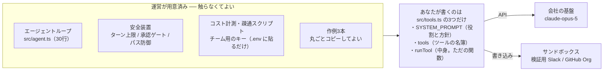

# 合宿キックオフ台本

> 初日の朝、参加者の前で話すための資料。上から順に話せば通ります。
> **灰色の「説明者メモ」は投影せず、話す側だけが読む欄**です。

| | |
| --- | --- |
| 全体 | 30分（話す）＋ 45分（ハンズオン） |
| 投影する | 01〜08 |
| 手元だけ | 説明者メモ・09 |
| 配布物 | テンプレートURL / キー / 事前資料「[これだけ](00-tldr.md)」1枚 |

> ⚠️ **事前資料は1枚だけにしてください。** 4本送ると0本読まれます。
> そして**読んでいない人がいる前提で組んであります。**レベル合わせは当日の [ハンズオン](04-handson.md) でやるので、事前に読まなかった人も置いていかれません。
> 投影スライドを作る場合は、[これだけ](00-tldr.md) がそのまま下敷きになります（`---` が1枚の区切り）。

---

## 01. なぜこれをやるのか　`3分`

> **こう切り出す**
> 「この2日間で作るのは、**AIエージェント**です。目的は、動くものを1つ作って持ち帰ること。**調べて詳しくなることではなく、作って詰まることが目的**です。」

伝えるのは3点だけです。

- **使う側から作る側になる** — 全員 Claude Code は使っている。あの裏側で何が起きているかを、自分の手で書いてみる
- **2日で動くものを1つ** — 大きさより、動くかどうか
- **詰まった話が一番の成果** — うまくいかなかった箇所は最終発表で共有する。それも加点対象

> 📝 **説明者メモ**
> ここで技術の話を始めないこと。**「読んできましたか?」という挙手も取らないこと。**読んでいない人を炙り出しても得るものはなく、その人が最初に萎縮します。
> 「エージェントとは何か」は 04 のハンズオンで全員まとめてやるので、ここでは触れずに進みます。

---

## 02. 2日間の流れ　`4分`

### Day 1

| 時刻 | 内容 | |
| --- | --- | --- |
| 09:30 | キックオフ（この資料） | ● |
| 10:00 | **全員ハンズオン（45分）** | ● 全員通るまで進まない |
| 10:45 | お題発表・チーム編成 | ● |
| 11:15 | **スコープを3行で書いて提出** | ★ 運営が全チーム分に目を通す |
| 12:00 | 昼食 | |
| 13:00 | 開発（まずツール1個で動かす） | |
| 16:00 | **中間チェック** | ● 動くか だけ見る |
| 16:30 | 開発 | |
| 19:00 | 終了 | |

### Day 2

| 時刻 | 内容 | |
| --- | --- | --- |
| 09:30 | 開発（機能を足すのはここまで） | |
| 12:00 | 昼食 | |
| 13:00 | 開発（仕上げ） | |
| 15:00 | **コードフリーズ・デモ準備** | ★ ここから機能追加は禁止 |
| 16:00 | **デモ発表**（1チーム7分・実機必須） | ● |
| 17:30 | 講評・振り返り | |
| 18:00 | 解散 | |

**● と ★ は、全員が同じ時刻に手を止めるポイントです。** 特に初日11時の「スコープ提出」と2日目15時の「コードフリーズ」は、守らないチームが必ず出るので、時間になったら口頭で止めます。

> 📝 **説明者メモ**
> - **10:00のハンズオン**は「全員通るまで次に進まない」と明言する。ここを流すと、午後に一人で詰まって黙る人が出ます。事前資料を読んできた人にも飛ばさせないこと（**環境が壊れている人をここで見つける**のが半分の目的です）
> - **16:00の中間チェック**で見るのは「動くものが1つあるか」だけ。設計の良し悪しには触れない。触れると手戻りが発生します
> - 時間は会場に合わせて調整可。ただし**「ハンズオン」「スコープ提出」「中間チェック」「コードフリーズ」の4つは削らない**

---

## 03. 環境 ── 何が用意済みで、何をやってもらうか　`5分`

**環境構築で悩む余地は残していません。** クローンして `.env` にキーを貼り、疎通スクリプトを走らせれば動きます。ここに15分以上かかったら、悩まず運営を呼んでください。

**そして、編集するファイルは `src/tools.ts` の1本だけです。** ループもコスト計測も承認ゲートも動いている状態から始まります。
書き方に詰まったら、動く作例が3本あります（ファイルを読む / HTTP を叩く / 状態を書き換える）。**丸ごとコピーして、そこから壊してください。**

### 守ってほしい3つ

1. **キーはリポジトリにコミットしない**（`.env` は gitignore 済み）
2. **書き込み系のツールは、必ずサンドボックスに向ける**
3. **コスト表示が桁違いに増えたら、止めて運営を呼ぶ**

> **ここは強めに言う**
> 「**書き込み系のツールは、必ずサンドボックスに向けてください。**本番のSlackに向けたままループを回すと、止める前に数十件投稿されます。これは腕の問題ではなく、全員に起こります。」

> 📝 **説明者メモ**
> コスト表示について。テンプレートは毎リクエストのトークン数と概算コストを標準出力に出します。**「監視されている」ではなく「感覚を掴むため」**だと説明してください。萎縮すると挑戦しなくなります。予算には十分な余裕があることも言い添えると、思い切って回してくれます。

---

## 04. ハンズオン ── 全員で45分　`ここで一度、話すのをやめる`

> **こう切り出す**
> 「ここから45分、**全員同じことをやります。**事前資料を読んできた人にはおさらいになりますが、飛ばさないでください。ここで環境が壊れている人を見つけたいので。」

手順は [ハンズオン](04-handson.md) に全部書いてあります。**投影しながら、参加者にも同じページを開いてもらってください。**

| | 時間 | やること | 手を動かすのは |
| --- | --- | --- | --- |
| 1 | 15分 | ループの説明（[これだけ](00-tldr.md) を投影 ＋ `src/agent.ts` を上から指でなぞる） | 運営 |
| 2 | 10分 | 手元で1回動かす（`bun run check` → `bun run agent "今日は何日?" -v`） | 全員 |
| 3 | 20分 | ツールを1個足す。**わざと雑な説明で書いて、呼ばれないのを見てから直す** | 全員 |

3が今日いちばん大事な20分です。伝えたい一点はこれだけです。

> **モデルは、あなたが書いた説明文しか読んでいません。実装は見えていません。**

> 📝 **説明者メモ**
> - **1で質問を取り始めると必ず溢れます。**「質問は3のあとで」と先に言うこと。説明が刺さらなくても、3で手を動かせば分かります
> - **2は全員が通るまで先に進まないこと。**ここで出るトラブルはほぼ「`.env` を作っていない」「残高・spend limit」「会場の回線」の3つです
> - **3-1 はうまくいかないのが正解です。**「動かない」と手が挙がったら成功なので、そう伝える。実行するたび結果が変わるのも、それ自体が「モデルがその場で順番を決めている」ことの実演になります
> - 経験者が早く終わったら、**チーム内の未経験者を見る役**を明示的に割り当ててください。ここでチーム内の差も同時に埋まります

---

## 05. お題　`5分`

### まず、いちばん大事な判定

> **「それ、ChatGPT に貼れば済みませんか?」**

済むなら、作る意味がありません。人が質問して人が答えを読むだけの用途は、既存のチャットサービスのほうが速くて安くて賢い。**自作エージェントが勝てるのは、チャットで済まない領域だけ**です。

| こういうとき | 本当は何を使うべきか |
| --- | --- |
| 人が質問して、人が答えを読む | 既存のチャットサービス。**自作する理由がない** |
| 社内システムを叩きたいだけ | MCP サーバーを1本書く。エージェント本体は既存のものを使う |
| 開発者が自分の手元でコードを触る | Claude Code |
| 定期実行したいだけ | マネージド型のエージェントサービス |
| **既存の画面・業務フローに埋め込む** | **自作** |
| **出力を別のシステムが受け取る** | **自作** |
| **量が出る（日次で数千件以上）** | **自作** |
| 手順が完全に固定 | ただのスクリプト。エージェントですらない |

### お題カテゴリ

下の5つから選びます。**どれも「チャットで済まない」側**に寄せてあります。

| カテゴリ | 何が「チャットで済まない」のか | 例 |
| --- | --- | --- |
| **A. 既存の画面に埋め込む** | 利用者にAIを意識させない。いつもの画面のボタン | 申請フォームの入力を下書きする／管理画面に「調査」ボタンを足す |
| **B. 出力を別システムが受け取る** | 出力の形が保証されている必要がある | 問い合わせを分類してIssueにラベルを付ける／CSVを生成して基幹に投入 |
| **C. 無人で回す** | 人がその場にいない。翌朝結果が置いてある | 夜間にログを見て異常を要約／週次でレビュー待ちPRを催促 |
| **D. 量を捌く** | 単価と速度の設計が要る | 過去の問い合わせ数千件を分類し直す／全リポジトリのREADMEを点検 |
| **E. 自由枠** | ── | 上の判定表で「自作」に入ることを説明できればOK |

### 選ぶときのコツ

**AとCがいちばん2日間に収まります。** Bは出力先のシステムを触る許可が要ることが多く、Dは規模の設計に時間を取られます。

迷ったら **A**。既存の画面がなければ、簡単なフォームを1枚作って「そこに埋まっている」形にすれば成立します。

> 📝 **説明者メモ**
> **この判定表を先に見せるのが今回いちばんの変更点**です。去年までのハッカソンでよくある「作ったけど ChatGPT でよくない?」という講評を、企画段階で潰せます。
>
> スコープ提出のときに **「なぜチャットで済まないのか」を1行で説明できるか**を見てください。説明できないチームは、お題を変えたほうが早いです。
>
> マルチエージェントをやりたいチームが出たら止めないでください。ただし**「1体でまず動かしてから2体目」の順番だけは約束させる**こと。いきなり2体で組むと、初日中に何も動かず2日目が消えます。

## 06. スコープの切り方　`6分`

ここがこの合宿でいちばん大事な話です。失敗するチームは、腕ではなく**スコープの取り方**で失敗します。

### ✕ 失敗するチーム

やりたいこと全部に同時着手 → 2日目の夕方まで、一度も通しで動かない → 最後に全部つなげようとして時間切れ。

### ○ うまくいくチーム

| 初日中に通す最小構成 | 2日目に足す | やらないと先に決める |
| --- | --- | --- |
| ツール1個。精度は問わない | ツールを増やす・精度を上げる | UI・認証・エラー処理・永続化 |

**最小構成が初日中に一度でも通れば、2日目は足すだけになります。** ここまで来たチームは必ず発表できます。

**「やらないこと」を先に書くのがコツ**です。UI、ログイン、丁寧なエラー処理、DBへの保存 ── どれも2日間では価値を生みません。コマンドラインで動けば十分です。

### 11時までに、この3行を提出してください

1. **誰の、どの手作業を**置き換えるか（例：サポート担当が毎朝やっている問い合わせの仕分け）
2. **エージェントに渡す「手」は何か** ── 3〜5個に絞って列挙（例：問い合わせ一覧を取る／過去事例を検索する／担当者に割り振る）
3. **今回やらないこと**（例：UIは作らない。実際の割り当ては行わず提案までにする）

> ✅ **迷ったときの判断基準**
> **「手順を先に全部書けるなら、それはエージェントにしなくていい」**。if文で書けることをエージェントにすると、遅くて高くて不安定なだけになります。**入力によって手順が変わる仕事**を選んでください。

> 📝 **説明者メモ**
> 提出された3行は運営が全部読み、**大きすぎるものだけ声をかけて削らせます**。この15分の介入が、2日目の発表数を決めます。
> 赤信号の目安は「ツールが6個以上」「2の中に『〜を学習する』『〜を自動生成する』のような曖昧な項目がある」。

---

## 07. 審査基準　`3分`

先に全部言っておきます。**動くこと ＞ きれいなこと**です。

| 見るところ | 具体的には |
| --- | --- |
| **実機で動く**（必須） | その場で動かして見せられること。スライドだけの発表は対象外 |
| エージェントらしさ | 手順の判断をモデルに任せているか。if文の分岐に置き換わっているものは評価しない |
| 実用性 | 明日から誰かが使いたいと思うか |
| 学び | **うまくいかなかった話も加点**。「こう作ったら破綻した」は全員の役に立つ |

コードの美しさ、テストの有無、UIの出来は見ません。2日間でそこに時間を使うのは損です。

> **締めの一言**
> 「デモは実機です。動かないものを動いたことにしてスライドで見せる、というのはナシにします。**逆に、半分しか動かなくても、動く半分を見せてくれれば十分評価します。**」

---

## 08. 詰まったときは　`2分`

- **15分ルール** ── 同じところで15分止まったら、Slackの `#合宿-質問` に投げる。抱え込まない
- 運営は**常時2名**が質問対応にいます。席まで来てもらってOK
- 他チームに聞くのも歓迎。カンニングという概念はありません
- **作例3本はコピーして使って構いません**（`examples/` に、ファイルを読む / HTTP を叩く / 状態を書き換える）。丸ごと `src/tools.ts` に上書きしてから壊すのが最短です

> ⚠️ **すぐ運営を呼んでほしいケース**
> コスト表示が桁違いに増えた／同じエラーがループし続けている／サンドボックス以外に書き込んでしまった。この3つは自力で粘らず、その場で手を挙げてください。

---

## 09. 想定Q&A　`投影しない`

| 質問 | 答え方 |
| --- | --- |
| Python書けないんですが大丈夫ですか | 大丈夫。テンプレートは動く状態で配っており、書くのは `src/tools.ts` の3つだけ（うち中身は普通の関数）。加えて Claude Code を使ってよいので、書けない部分は聞きながら進められる |
| Claude Code を使って作っていいんですか | **むしろ推奨**。エージェントでエージェントを作る形になる。ただしデモは自分たちの成果物を動かすこと |
| LangChain など好きなライブラリを使っていいですか | 自由。ただし2日しかないので、初めて触るフレームワークの学習に時間を溶かさないこと。素のSDKで十分作れる |
| 社内の実データを使っていいですか | **事前に決めたルールに従って答える**（※当日までに情シスと確定させておくこと）。判断がつかないデータは使わず、ダミーで代替する |
| お題を途中で変えてもいいですか | 初日中ならOK、2日目は不可。変えるときは運営に一声かける |
| 精度が全然出ないんですが | まずツールの説明文（description）を疑う。モデルはそこしか読んでいない。次にツールの戻り値。この2つで大半が直る |
| モデルがツールを呼んでくれません | 同上。説明文に「いつ使うか」が書かれていないケースがほとんど |
| 1人でも参加できますか | チーム推奨だが、可。ただしスコープは通常の半分に切ること |
| `check` が 400 で落ちます | 残高側の問題でコードは正常。`check` が出すワークスペースIDを運営に伝えてもらう |
| Claude Code は動くのに、自分のコードだと 400 になります | **プランと API クレジットは別会計。**Claude Code は OAuth、テンプレートは API キーで動いている。運営側の設定問題なので待っていてよい |
| コストはどれくらい使っていいですか | 気にせず回してよい。予算は確保済み。桁違いに増えたときだけ声をかけてほしい、という基準 |
| 作ったものは合宿後どうなりますか | リポジトリは残す。実運用に載せたいものは合宿後に別途相談（※方針を事前に決めておくこと） |
| エージェントの経験がまったくないんですが | **その前提で組んでいます。**10時からの45分で全員同じ場所に立ちます。事前資料を読んでいなくても置いていきません |
| ループを自分で書いてみたいです | 大歓迎。[作る順番](05-reference.md) の Step 0〜2 に、1ファイルでゼロから組む手順があります。ただしチームの成果物は用意済みのループで作ること |
| 資料が多くて読み切れません | 事前に読むのは [これだけ](00-tldr.md) の1枚で足ります。残りは詰まったときに引く用です |

> 📝 **説明者メモ ── 話すときの注意**
> - **技術の詳細に踏み込まない。** キックオフは30分。個別の技術質問は「あとで席に行きます」で受け流し、全体の時間を守る
> - **「難しそう」と思わせない。** 実際にやることの8割は普通のプログラミングだと明言する
> - **※印の2項目**（実データの扱い／成果物の後日の扱い）は、当日までに答えを確定させておくこと。曖昧なまま当日を迎えると、質問された瞬間に信頼を失います

---

*関連： [これだけ](00-tldr.md) ／ [運営ランブック](01-runbook.md) ／ [電話越しの現場監督](02-agent-primer.md) ／ [ハンズオン](04-handson.md) ／ [作る順番](05-reference.md)*
